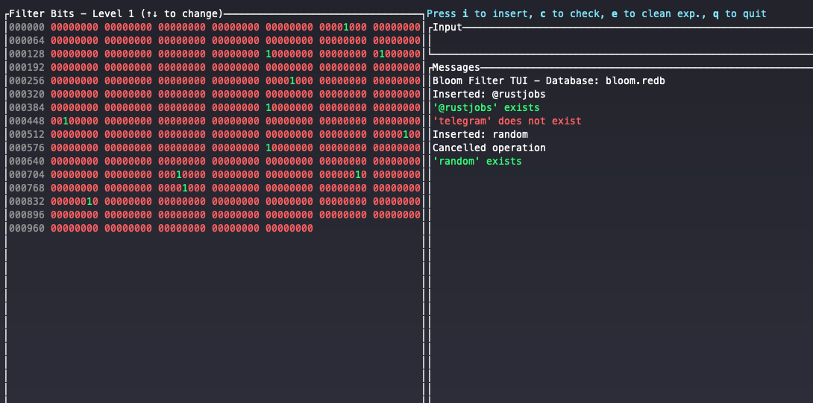

# probabilistic-rs

[](https://crates.io/crates/probabilistic-rs)
[](https://docs.rs/probabilistic-rs)
[](https://codecov.io/gh/oiwn/probabilistic-rs)
[](https://deps.rs/repo/github/oiwn/probabilistic-rs)

# Time-Decaying Bloom Filter

A Rust implementation of a **time-decaying Bloom filter** with multiple storage
backends and a high-performance HTTP API server.

## Overview

This crate provides multiple Bloom filter implementations:

1. **Core Bloom Filter** - A high-performance, persistent Bloom filter with bulk operations
2. **Time-Decaying Bloom Filter** - Automatically expires elements after a configurable time period using a sliding window approach

Perfect for rate limiting, caching, deduplication, and tracking recently seen items where older data becomes less relevant over time.



### Key Features

#### Core Bloom Filter
- **High-performance bulk operations** - insert and query multiple items with single lock acquisition
- **Persistent storage** with Fjall backend for durability across restarts
- **Configurable false positive rate** - tune memory usage vs. accuracy tradeoffs
- **Thread-safe** with interior mutability for concurrent access
- **Memory efficient** with optimized bit vector storage

#### Time-Decaying Bloom Filter
- **Time-based automatic element expiration** - items naturally age out without manual intervention
- **Multiple storage backends**:
  - In-memory for maximum performance
  - Fjall persistence for durability across restarts
- **Multi-level sliding window design** with timestamp-based expiration

#### Complete API Ecosystem
- **HTTP server** with Swagger UI documentation (for expiring bloom)
- **CLI** with interactive TUI mode
- **Programmatic Rust API**

## Core Bloom Filter

The core Bloom filter provides a high-performance, persistent implementation with optimized bulk operations.

### Features

- **Bulk Operations**: Insert and query multiple items with single lock acquisition
- **Persistence**: Optional Fjall backend for durable storage
- **Thread Safety**: Interior mutability allows concurrent access without external locks
- **Memory Efficient**: Optimized bit vector storage with configurable chunk sizes

### Bulk Operations Performance

Bulk operations provide significant performance benefits for batch workloads:

- **Single Lock Acquisition**: One lock per bulk operation vs per-item locks
- **Batch Hash Computation**: All hashes computed before acquiring locks
- **Reduced Contention**: Minimized lock contention in concurrent scenarios
- **Memory Efficiency**: Pre-allocated result vectors avoid reallocations

## Time-Decaying Bloom Filter

The time-decaying Bloom filter uses a sliding window approach with the following
characteristics:

1. **Sub-Filters**: The main Bloom filter is divided into N sub-filters (BF_1, BF_2, …, BF_N)
2. **Time Windows**: Each sub-filter corresponds to a fixed time window T (e.g., 1 minute)
3. **Rotation Mechanism**: Sub-filters are rotated in a circular manner to represent sliding time intervals

### Operations

- **Insertion**: Elements are added to the current active sub-filter with timestamps
- **Query**: Checks for element presence across all non-expired sub-filters
- **Cleanup**: Automatically removes expired elements based on configured time windows

## Usage

Add this to your `Cargo.toml`:

```toml
[dependencies]
probabilistic-rs = "0.4"
```

### Core Bloom Filter Example

```rust
use probabilistic_rs::bloom::{
    BloomFilter, BloomFilterConfigBuilder, BloomFilterOps, BulkBloomFilterOps
};

#[tokio::main]
async fn main() -> Result<(), Box<dyn std::error::Error>> {
    // Create a core Bloom filter
    let config = BloomFilterConfigBuilder::default()
        .capacity(10000)
        .false_positive_rate(0.01)
        .build()?;

    let filter = BloomFilter::create(config).await?;

    // Individual operations
    filter.insert(b"item1")?;
    assert!(filter.contains(b"item1")?);

    // Bulk operations - much faster for multiple items
    let items: Vec<&[u8]> = vec![b"item2", b"item3", b"item4", b"item5"];
    filter.insert_bulk(&items)?;

    let results = filter.contains_bulk(&items)?;
    assert!(results.iter().all(|&exists| exists));
    
    Ok(())
}
```

### Persistent Core Bloom Filter

```rust
use probabilistic_rs::bloom::{
    BloomFilter, BloomFilterConfigBuilder, PersistenceConfigBuilder
};
use std::path::PathBuf;

#[tokio::main]
async fn main() -> Result<(), Box<dyn std::error::Error>> {
    let persistence_config = PersistenceConfigBuilder::default()
        .db_path(PathBuf::from("my_bloom_db.fjall"))
        .chunk_size_bytes(4096) // 4KB chunks
        .build()?;

    let config = BloomFilterConfigBuilder::default()
        .capacity(100000)
        .false_positive_rate(0.01)
        .persistence(Some(persistence_config))
        .build()?;

    let filter = BloomFilter::create(config).await?;

    // Bulk insert with persistence
    let bulk_items: Vec<Vec<u8>> = (0..1000)
        .map(|i| format!("item_{:04}", i).into_bytes())
        .collect();
    let bulk_refs: Vec<&[u8]> = bulk_items.iter().map(|item| item.as_slice()).collect();
    
    filter.insert_bulk(&bulk_refs)?;
    filter.save_snapshot().await?;
    
    Ok(())
}
```

### Time-Decaying Bloom Filter Example

```rust
use probabilistic_rs::{FilterConfigBuilder, InMemorySlidingBloomFilter, SlidingBloomFilter};
use std::time::Duration;

fn main() -> Result<(), Box<dyn std::error::Error>> {
    // Configure the filter
    let config = FilterConfigBuilder::default()
        .capacity(1000)
        .false_positive_rate(0.01)
        .level_duration(Duration::from_secs(60))
        .max_levels(3)
        .build()?;

    // Create an in-memory filter
    let mut filter = InMemorySlidingBloomFilter::new(config)?;

    // Insert and query items
    filter.insert(b"test_item")?;
    assert!(filter.query(b"test_item")?);
    
    Ok(())
}
```

### Persistent Filter with Fjall

```rust
use probabilistic_rs::{    ExpiringBloomFilter, FilterConfigBuilder, FjallFilter, FjallFilterConfigBuilder,
};
use std::{path::PathBuf, time::Duration};

fn main() -> Result<(), Box<dyn std::error::Error>> {
    let config = FilterConfigBuilder::default()
        .capacity(10000)
        .false_positive_rate(0.01)
        .level_duration(Duration::from_secs(60))
        .max_levels(5)
        .build()?;

    // Filter state persists across program restarts
    let fjall_config = FjallFilterConfigBuilder::default()
        .db_path(PathBuf::from("bloom_database.fjall"))
        .filter_config(Some(config))
        .snapshot_interval(Duration::from_secs(60))
        .build()?;

    let filter = FjallFilter::new(fjall_config)?;
    filter.insert(b"persistent_item")?;
    filter.save_snapshot()?;

    // Later or in another process:
    // let filter = FjallFilter::new(
    //     FjallFilterConfigBuilder::default()
    //         .db_path(PathBuf::from("bloom_database.fjall"))
    //         .build()?,
    // )?;
    // filter.query(b"persistent_item")?; // Returns true if not expired

    Ok(())
}
```

### Using the HTTP Server

```rust
use probabilistic_rs::{ServerConfigBuilder, FilterConfigBuilder};
use std::time::Duration;

#[tokio::main]
async fn main() -> Result<(), Box<dyn std::error::Error>> {
    // Configure the server
    let server_config = ServerConfigBuilder::default()
        .server_host("127.0.0.1".to_string())
        .server_port(3000)
        .bloom_db_path("bloom.fjall".to_string())
        .bloom_capacity(10000)
        .bloom_false_positive_rate(0.01)
        .bloom_level_duration(Duration::from_secs(60))
        .bloom_max_levels(3)
        .build()?;

    // Start the server
    probabilistic_rs::run_server(server_config).await?;
    
    Ok(())
}
```

## Command line interface

The crate includes a command-line interface with both command mode and an interactive TUI:

```bash
# Create a new filter
expblf create --db-path myfilter.fjall --capacity 10000 --fpr 0.01

# Insert an element
expblf load --db-path myfilter.fjall insert --element "example-key"

# Check if an element exists
expblf load --db-path myfilter.fjall check --element "example-key"

# Start interactive TUI
expblf tui --db-path myfilter.fjall
```

## API Endpoints

The HTTP server provides the following REST endpoints:

- `GET /health` - Health check endpoint
- `POST /items` - Insert an item into the filter
- `GET /items/{value}` - Query if an item exists in the filter
- `POST /cleanup` - Manually trigger cleanup of expired items
- `/swagger-ui` - Interactive API documentation


## Configuration Options

The filter can be configured with the following parameters:

| Parameter | Description | Default |
|-----------|-------------|---------|
| `capacity` | Maximum number of elements | 1,000,000 |
| `false_positive_rate` | Desired false positive rate | 0.01 (1%) |
| `level_duration` | Duration before level rotation | 60 seconds |
| `max_levels` | Number of filter levels | 3 |
| `hash_function` | Custom hash function | Combined FNV-1a/Murmur3 |


## Performance

### Core Bloom Filter Performance

The core Bloom filter is optimized for high-throughput workloads:

#### Bulk Operations Benefits
- **2-5x faster** insert throughput for large batches (1000+ items)
- **3-7x faster** query throughput for large batches
- **Single lock acquisition** vs per-item locks
- **Batch hash computation** reduces CPU overhead

#### Memory Usage

Memory usage is optimized with bit-level storage:

```
total_bits = ceil(-capacity * ln(false_positive_rate) / (ln(2)^2))
memory_bytes = ceil(total_bits / 8)
```

### Time-Decaying Bloom Filter Performance

Bro, it's 🦀🦀🦀 RUST 🦀🦀🦀 and its BLAZINGLY FAST 🚀🚀🚀

#### Memory Usage

Memory usage is calculated as:

```
total_bits = capacity * max_levels
memory_bytes = total_bits * 8
```

Since i use `u8` to store `bool`.

## Contributing

Contributions are welcome! Please feel free to submit a Pull Request. For major changes, please open an issue first to discuss what you would like to change.

## License

This project is licensed under the MIT License - see the LICENSE file for details.
